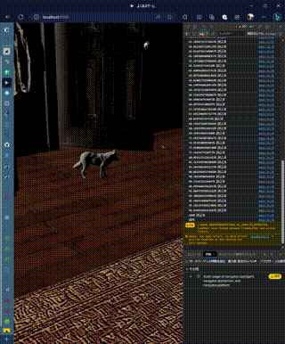
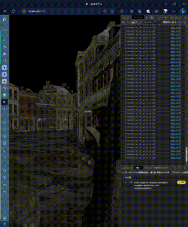

# node_WebGL_game

2023.07.01-02 サポーターズ主催ハッカソン 制作物

## 2023.06.23

ギットリポジトリとかDokerFileとか基本的なの作ったよ！

## 2023.06.24

htmlとJSを書く。何とか動いたメポ(*≧pq≦)。とりあえず円形カメラ移動を作ったケド、固定カメラのゲームを作ろうか？（決めてない）

`"The Bathroom (Free)" (https://skfb.ly/6ZYYo) by Evan is licensed under Creative Commons Attribution (http://creativecommons.org/licenses/by/4.0/).`

とりあえず見切り発車白紙化前提でFPSっぽくしようとしてみた。ふーんエッチじゃん。( ;･`д･´)

`"After the rain... - VR & Sound" (https://skfb.ly/6uQxu) by Aurélien Martel is licensed under Creative Commons Attribution-NonCommercial (http://creativecommons.org/licenses/by-nc/4.0/).`  
`"QBZ-95 With Hands And Animations" (https://skfb.ly/oIvHr) by BillyTheKid is licensed under Creative Commons Attribution (http://creativecommons.org/licenses/by/4.0/).`

