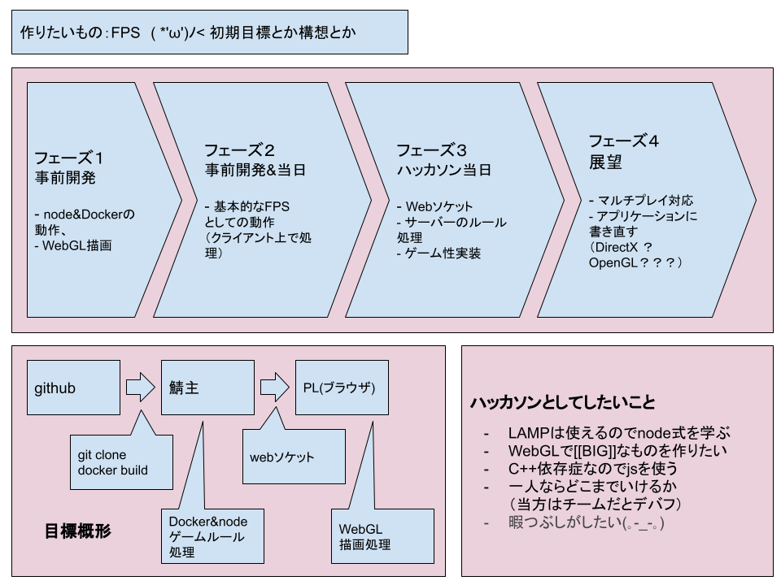
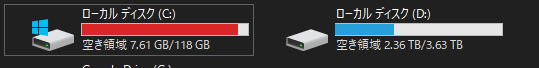
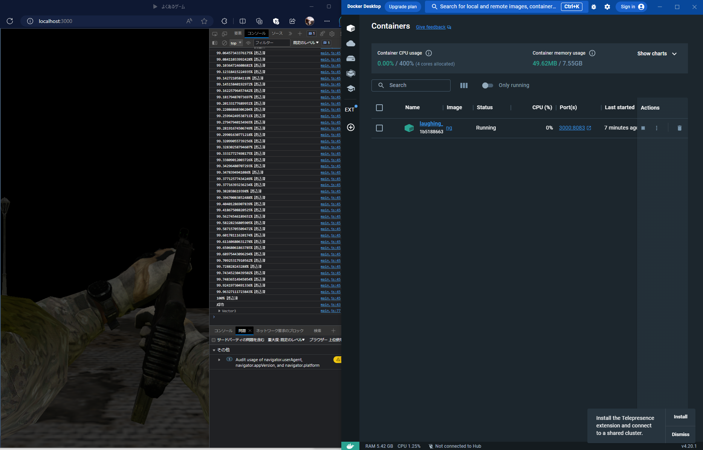
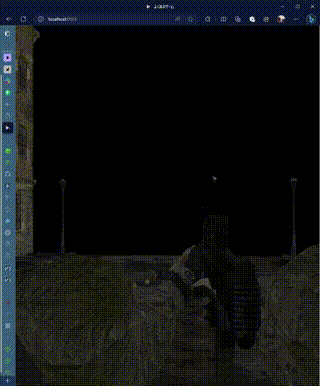
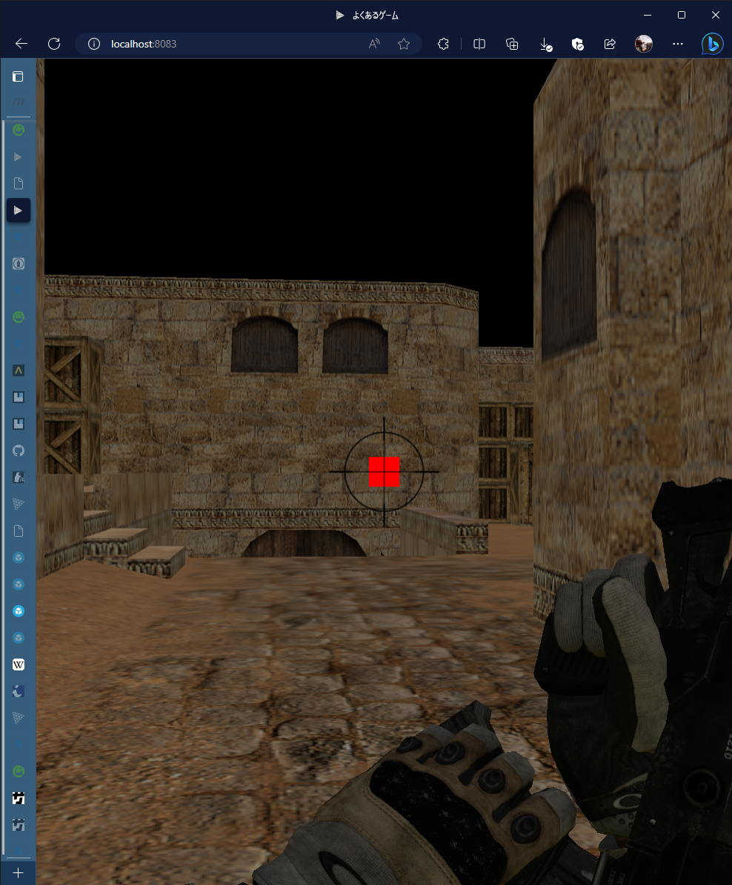
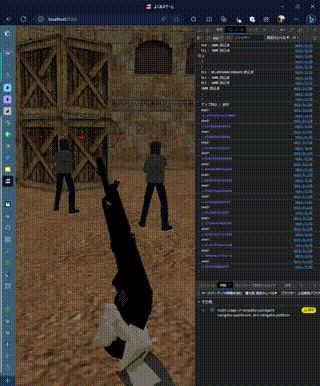
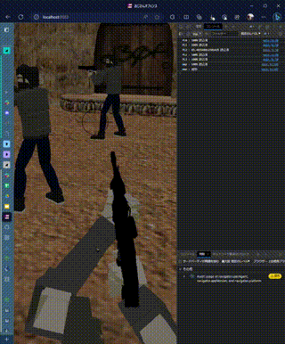
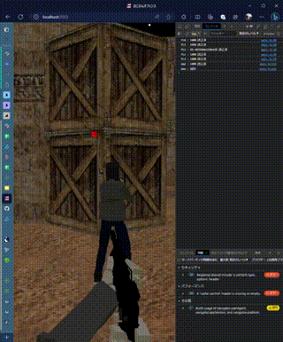
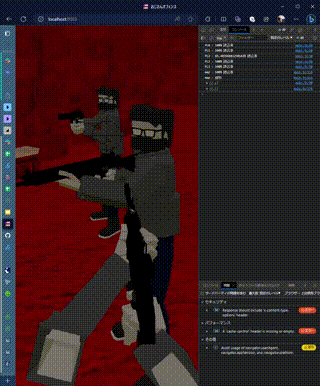

# ブラウザFPS「おじさんオフェンス」

2023.07.01-02 サポーターズ主催ハッカソン 制作物  
企業賞_株式会社ゆめみ

## 遊び方

0. `docker node npm`を使えるようにする。
1. Dockerを起動する。

```powershell
docker build -t nwg .
docker run -d -p 3000:8083 nwg
```

2. どっかーを起動した鯖のlocalhostなりローカルIPの3000ポートにアクセスする。  
  `localhost:3000`
1. ゲームする。(*ﾉ´∀`)ﾉ

## 開発の記録（ハッカソンなので……( -'д-)y-~）

### 目標



### 2023.06.23_事前開発期間

ギットリポジトリとかDokerFileとか基本的なの作ったよ！

### 2023.06.24

htmlとJSを書く。何とか動いたメポ(*≧pq≦)。とりあえず円形カメラ移動を作ったケド、固定カメラのゲームを作ろうか？（決めてない）


`"The Bathroom (Free)" (https://skfb.ly/6ZYYo) by Evan is licensed under Creative Commons Attribution (http://creativecommons.org/licenses/by/4.0/).`

とりあえず見切り発車白紙化前提でFPSっぽくしようとしてみた。ふーんエッチじゃん。( ;･`д･´)


`"After the rain... - VR & Sound" (https://skfb.ly/6uQxu) by Aurélien Martel is licensed under Creative Commons Attribution-NonCommercial (http://creativecommons.org/licenses/by-nc/4.0/).`  
`"QBZ-95 With Hands And Animations" (https://skfb.ly/oIvHr) by BillyTheKid is licensed under Creative Commons Attribution (http://creativecommons.org/licenses/by/4.0/).`

### 0625

ラズパイでnodeでとりあえず動かしてみると以下のエラーが発生！(Pд\`q｡)  
`SyntaxError: Unexpected token 'v', "version ht"... is not valid JSON`  
でもメインPCでは動くから権限エラーとか疑って三時間ぐらいかけてようやく解決の糸口を見つける。→<https://github.com/0hq/WebGPT/issues/25>  
そう言えばpushするときにlfs使ったのにpullするとき使ってなかったわ……m9(ﾟдﾟ)っｿﾚﾀﾞｯ!!

git resetをたぶん一番使った日になりました……（チーム開発だとこれが初日から起こったんだろうなぁ）

なにはともあれラズパイをnodeゲーム鯖として起動できた！あとはこれをDocker上で動かしたいが時間かかりすぎ問題。見積りでbuildに二時間かかるらしい。



DockerはCドライブ以外のダウンロード選択肢がないのでメインPCには入れたくなかったが仕方なくDokerDesktopをインストールして実行



動いた( *'w')b

あとはハッカソン当日にゲーム内容を充実させるだけ……でいいのだろうか。当方は訝しんだ。

### 0629

移動を視点先へ変更。結構簡単だった。('ε'@)



120MBのマップデータは大きすぎる→1MBのマップデータに変更！CSGO風マップ( *'ω')ﾉ  
ついでにレティクルも設置



`"de_dust2 - CS map" (https://skfb.ly/6ACOH) by vrchris is licensed under Creative Commons Attribution (http://creativecommons.org/licenses/by/4.0/).`

### 0630

明日のために学校の課題片づける(\*´∀`\*)-３

favicon.icoを変えて寝る。

### 0701

- 駆動系改善、視点移動改善 - 結構大規模に事前準備のやつ作り直した
- プレイヤーをクラス制御 - メンターさんに感謝


- 念願の銃弾発射



遂に避けてきた三次元空間上での三角関数を使う…\(\* \_ω\_\)<https://ics.media/entry/10657/>
そしてついに上下に狙って上下に打てるようになった。ついでにリロードの動作（THREE.Clock().getDelta()）も改善。



26:00だ！もう寝よう∑(\*ﾟωﾟ\*)
明日こそSocketio使えるかな

### 0702

当たり判定が難しい。重いし、あげくプレイヤーには当たらない。とりあえずサーバーを触るだけ触りたい。



